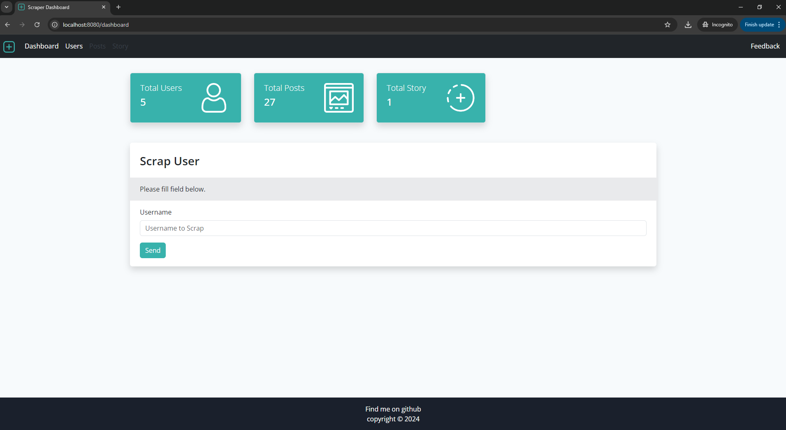
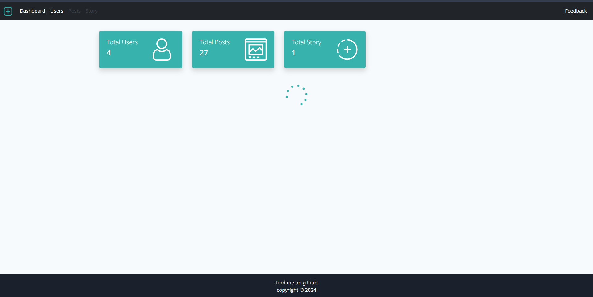
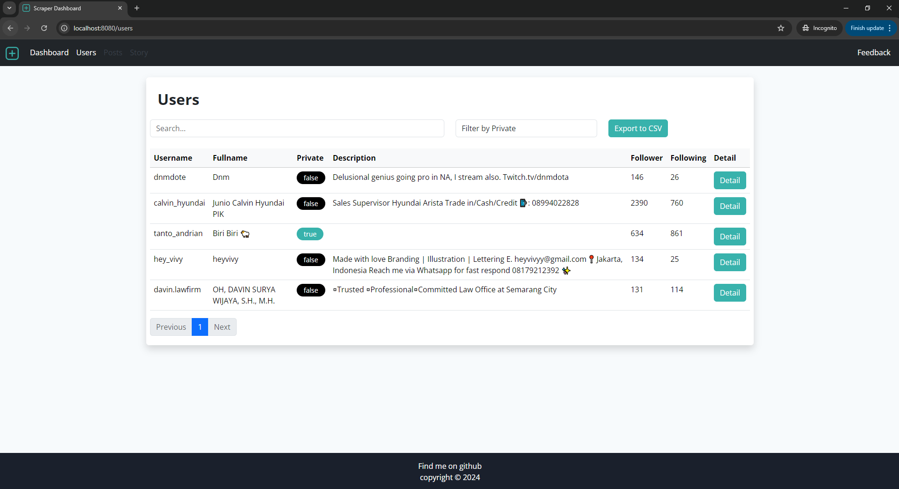
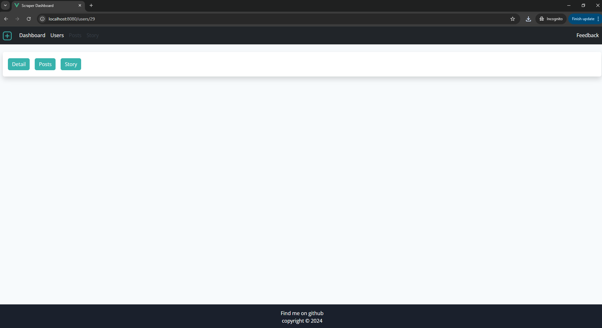
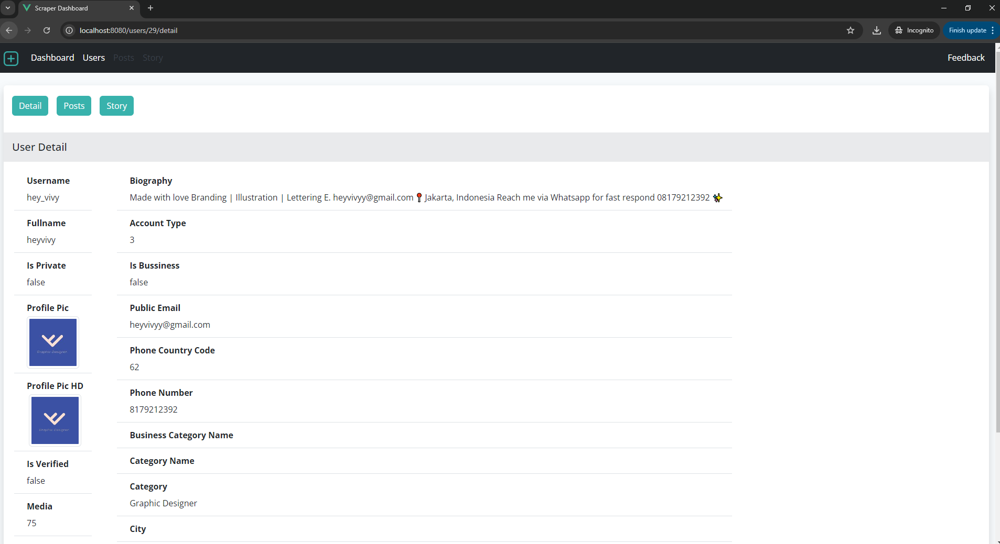
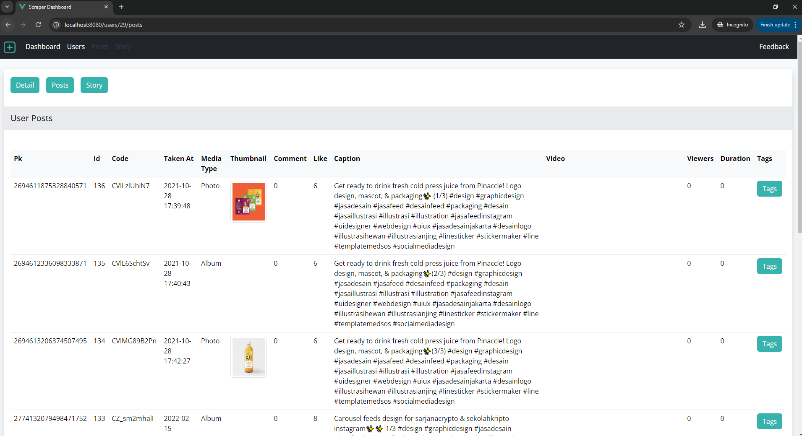
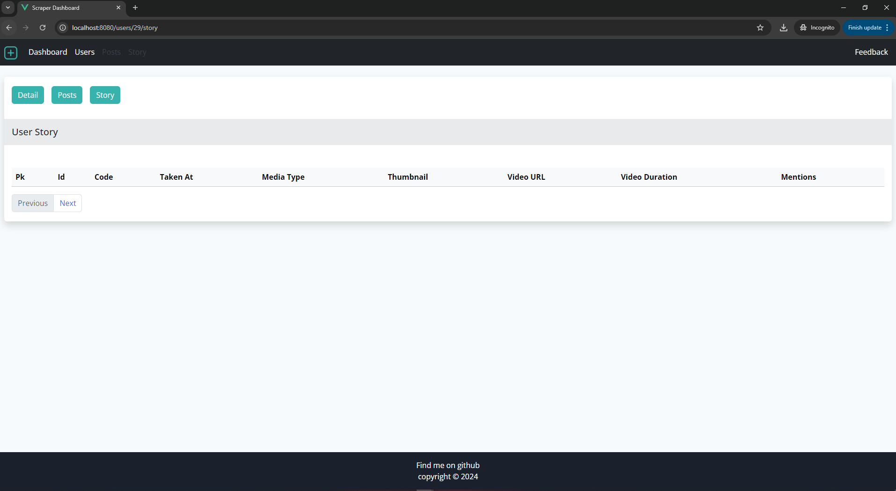
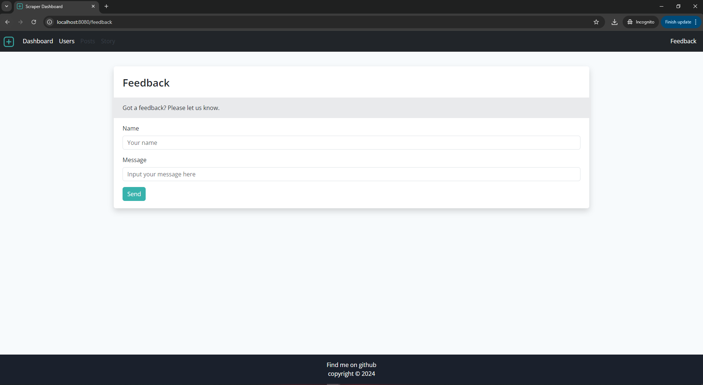

# Instagram Scraper Program

## Overview

This project is an Instagram Scraper application built with a **Python Flask** backend and **Vue.js 3** frontend. The application allows users to scrape Instagram data such as user profiles, posts, and stories. It stores the scraped data in a MySQL database and provides an API to interact with the data.

## Features

- Scrape Instagram users, posts, and stories.
- Store scraped data in a MySQL database.
- Retrieve scraped data through APIs (users, posts, stories).
- Support for bulk data scraping.
- Count API for users, posts, and stories.
- Vue.js frontend to display scraped data.
- Backend implemented with Python Flask and Instagrapi.

---

## Project Structure

```bash
|-- backend
    |-- migrations/            	# SQLAlchemy migration
    |-- models/            	# SQLAlchemy models
    |-- routes/            	# API route handlers
    |-- src/            	# Scraping handler
    |-- static/            	# Media Folder
    |-- util/            	# Utility functions
    |-- app.py               	# Main Flask application
    |-- config.py            	# Configuration for Flask and MySQL
    |-- scraping.py          	# Instagram scraping logic using Instagrapi
    |-- requirements.txt     	# Python dependencies
|-- frontend
    |-- src
        |-- App.vue          	# Main Vue.js App
	|-- main.js          	# Main js for Vue.js App
	|-- router.js          	# Router for Vue.js App
	|-- assets/           	# Asset for website
        |-- components/       	# Vue.js components
        |-- pages/            	# Frontend views for displaying data
    |-- public               	# Static files
    |-- package.json         	# JavaScript dependencies
```

---

## Requirements

### Backend

- Python 3.8+
- Flask
- MySQL database
- Instagrapi
- SQLAlchemy

### Frontend

- Node.js 14+
- Vue.js 3

---

## Setup Instructions

### Backend

Please take a look at backend folder

### Frontend

Please take a look at frontend folder

---

## API Endpoints

Please take a look at backend folder

---

## Database Schema

Please take a look at backend folder

---


## Screenshot


















---

## License

This project is licensed under the MIT License. See the LICENSE file for more details.

---

This structure gives users a comprehensive guide to your program, including how to set up the environment and understand the API functionality.
